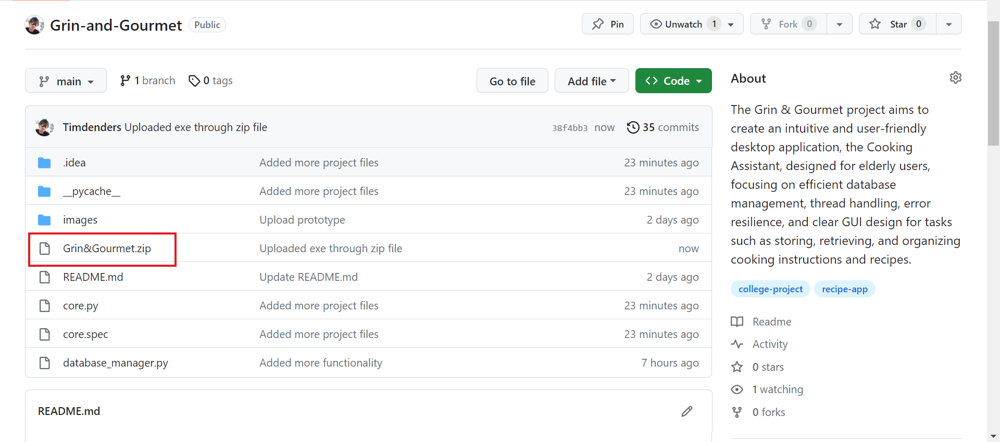
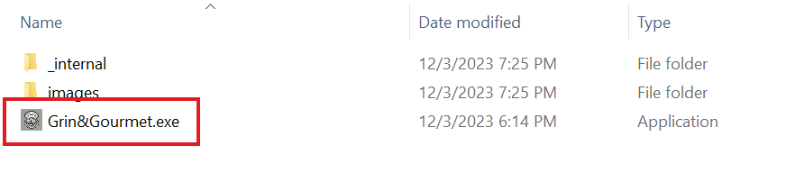
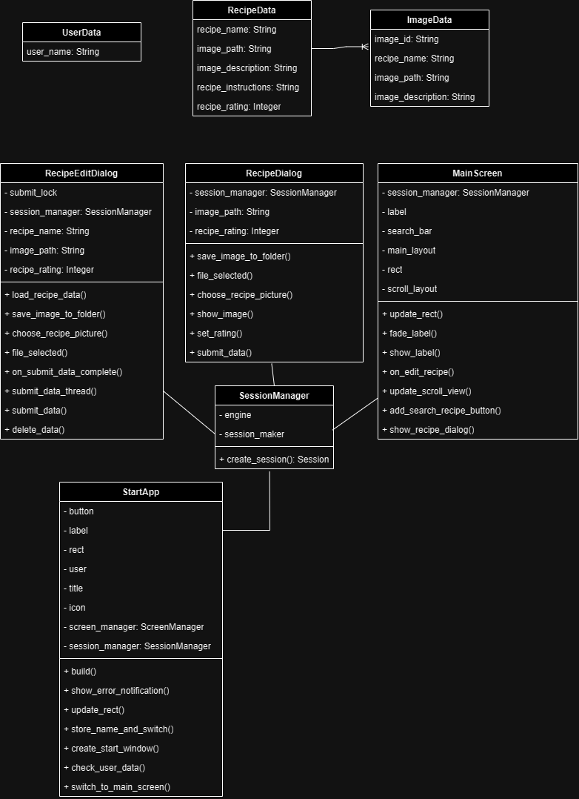
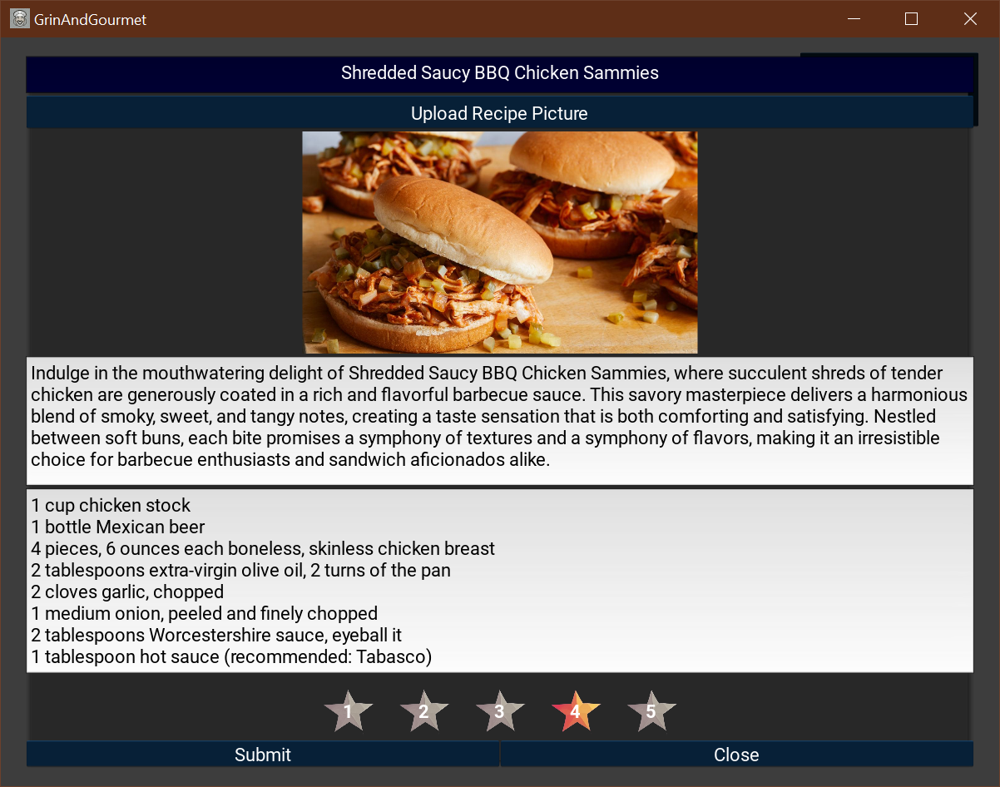
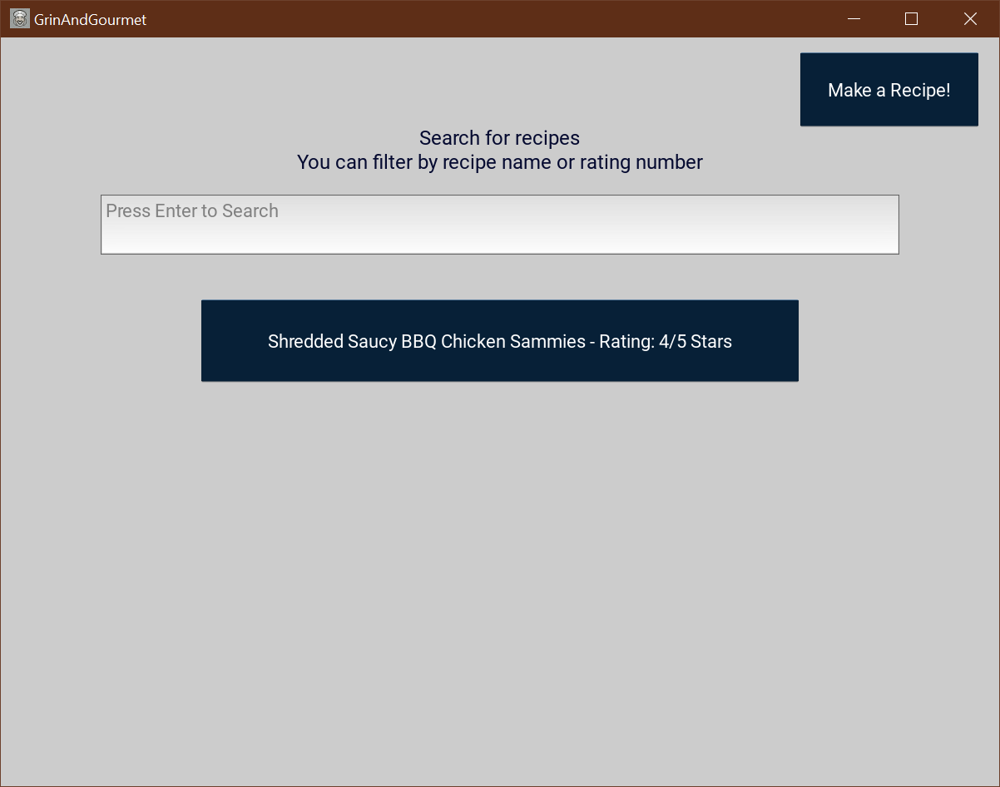
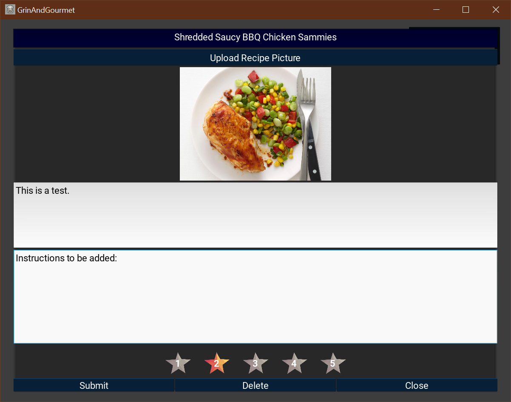
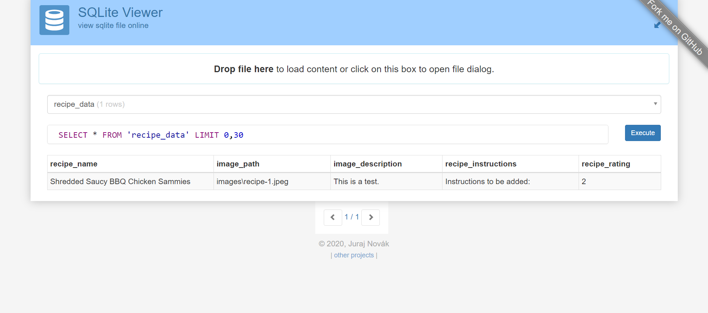
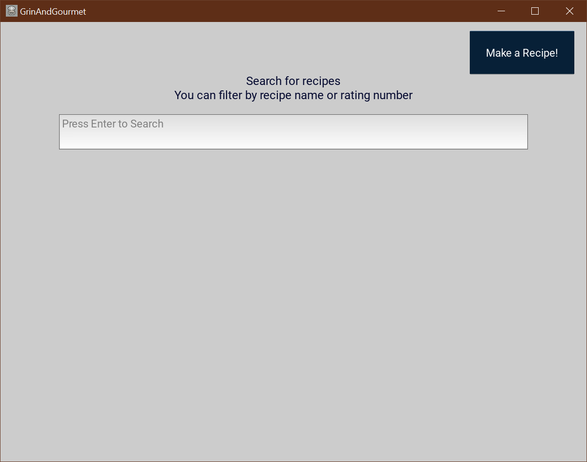
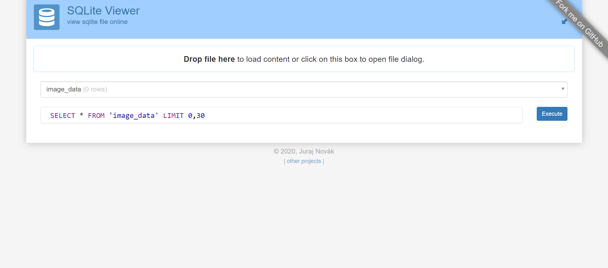

<h1 align="center"> Grin & Gourmet </h1>

<h3 align="center"> Team Members: Timothy Enders, Xingyu Jiang</h3>

## Introduction
   - Project Overview:
     - Grin and Gourmet is envisioned as a desktop application tailored for elderly users, providing an intuitive interface for storing, retrieving, and organizing recipes and their corresponding images.
   - Objective:
     - The primary goal of this project is to create an application that can assist users who are interested in storing their recipes and sharing them with others. It should have a robust backend functionality for managing recipe data, images, and optional ratings. We aim to create an application that is as user-friendly as possible, so elderly users won't have any issues interacting with the application interface.
   - Significance of the Project:
     - We believe making delicious food with friends and family can spark joy and happiness for everyone involved. Grin & Gourmet can help enhance that experience by helping them save the recipes of the dishes they love.
## Installation Instructions

To access the Grin & Gourmet app, please download the zip file from the following location:

 
Unzip the file by right-clicking on the zip file and selecting "Extract All." Click on "Extract" to proceed. A new folder will emerge in the same directory. Navigate into it, access the subsequent folder, and double-click on the "Grin&Gourmet.exe" file
 

## Usage Instructions
### Start Screen:
- If you haven't done so already, input your name and then click the "submit" button. This action will present a warm welcome message incorporating the entered name.
### Main Screen:
- On the main screen, you can view your recipes if any have been created.
- Utilize the search bar to filter recipes by name or rating.
- To edit or view a recipe, select the recipe, triggering a dialog box for editing purposes.
- To create a new recipe, click the button located in the top-right corner. This action will open a dialog box for you to compose a new recipe.
### Edit/Create Dialog Box:
- Within this dialog box, provide details such as the recipe name, description, and instructions, and select a rating.
- Clicking the "upload image" button opens a separate window, enabling you to choose an image from your computer to display in the dialog box.
- Selecting the "submit" button will either create a new recipe or save the edits.
- If in the edit dialog box, a delete button will be visible. Clicking it will delete the recipe.
- The close button deactivates the dialog box.

## Code Structure
This app is built using Kivy for the UI and SQLAlchemy for managing recipe data in a database. It allows users to create, edit, and delete recipes while providing a user-friendly interface for interaction.
### Code Components:
1. **StartApp**: Manages app initialization, screen transition, and user data checks.
2. **MainScreen**: Main interface displaying recipes and allowing CRUD operations.
3. **RecipeDialog** and **RecipeEditDialog**: ModalViews for creating/editing recipes.
4. **UserData**, **ImageData**, **RecipeData**: SQLAlchemy models for data structures.
5. **SessionManager**: Handles database interactions.
6. **File Handling and UI Components**: Functions for UI creation, file handling, and event management.

### UML Diagram:

## List of Functionalities and Test Results
### Create a Recipe:
- **Functionality**
     - Users can input recipe names, accompanied by their description, image path, instructions, and rating, with all information being promptly updated in the database file.
   
  

  
  

- **Test Results**
     - **Add Recipe Name:** Successful.
     - **Display Image and Add Image Path:** Successful.
     - **Add Description:** Successful.
     - **Add Instructions:** Successful.
     - **Add Rating:** Successful.
   
  

  
   
  
  

### Edit a Recipe:
- **Functionality**
     - Users can modify the recipe description, image path, instructions, and rating, with all changes promptly reflected in the database file.
   
  

  
  

- **Test Results**
     - **Display Image and Edit Image Path:** Successful.
     - **Edit Description:** Successful.
     - **Edit Instructions:** Successful.
     - **Edit Rating:** Successful.
   
  

  
   
  
  

### Delete a Recipe:
- **Functionality**
     - Users can remove a recipe, and this action will be reflected in the database file.
   
  

  
  

- **Test Results**
     - **Delete Recipe:** Successful.
   
  

  
  

## Discussion and Conclusions
### Project Issues and Limitations:
1. **Scalability**: The current version of Grin & Gourmet can face some challenges in scaling for larger datasets. If performance issues might arise when there substantial number of recipes.
2. **File Handling**: Uploading large image files might pose challenges in terms of storage management and loading times.
3. **Testing Coverage**: Grin & Gourmet has not yet been through as extensive testing as we were like. There might still be some edge cases and error scenarios that have not been covered. 
4. **Insufficient Market Research**: Grin & Gourmet hasn't undergone public testing yet, leaving uncertainties about how individuals beyond our team perceive the UI design

### Application of Course Learning:
1. We have made use of threading for concurrent operations, especially in handling user-initiated tasks like uploading images, editing, deleting recipes, preventing the GUI from freezing during database operations.
2. File system interactions and I/O operations are utilized when handling image files, managing their paths, copying, deleting, and ensuring proper storage. 
3. For I/O Operations, we mainly utilize an external library, kivy, to handle user interaction with the application.  

